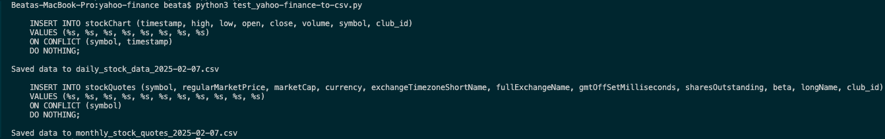

# YAHOO FINANCE REAL TIME

## HEJ CALLE ヾ( ˃ᴗ˂ )◞ • *✰
* **dags_yahoo-finance-pipeline.py** är den filen jag tänker mig ska till airflow
* De delar jag är osäker på eller som behöver åtgärd (vad jag vet) har **TODO** kommentarer
* *test_yahoo-finance-to-csv.py testar hämta data från APIet och spara som csv filer för att se exempel på datan / strukturen*

## NOTES
* Vi börjar med AIK och Manchester United
* Väljer ut vad av datan i API response som sparas, är säkert mer som är intressant men kan börja med detta?
* I uploadToDB används cloudsqlmigration.postgres.merge_to_postgres - **OSÄKER** på hur jag kommunicerar med postgres här och om det är rätt sätt! Är inte testat mot postgres - borde jag testa att typ mocka den merge_to_postgres funktionen mot en lokal db för att se hur det fungerar?
* Skapar merge query - om jag ska ha det?  Kan jag ens använda det sättet när vi går från dataframe in till postgres och inte från BQ? Queryn och dataframen skickas som argument till metoden ovanhär printas den när jag kör test scriptet: 

